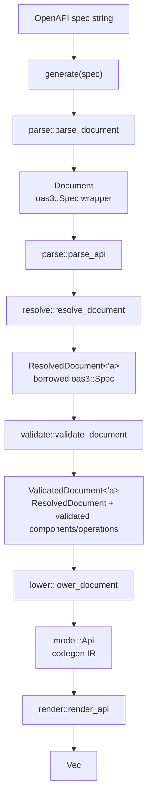
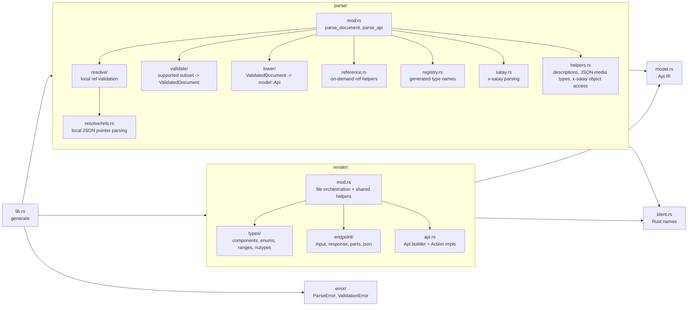
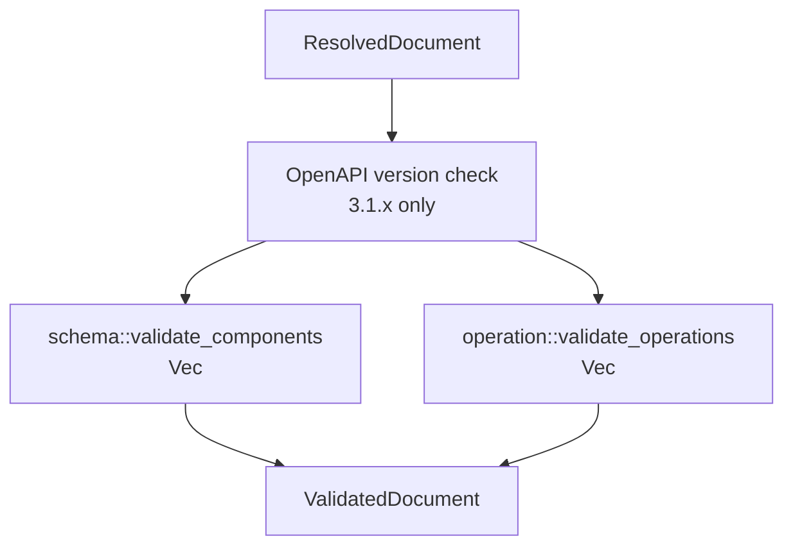
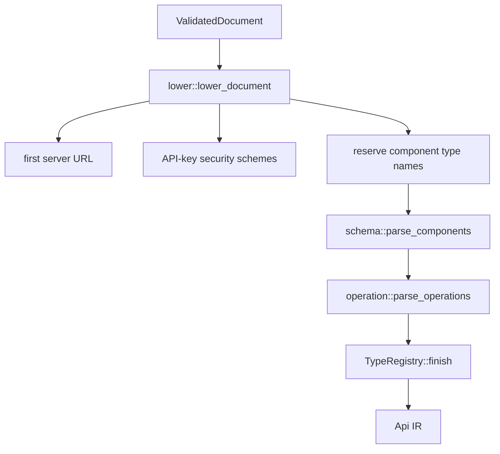
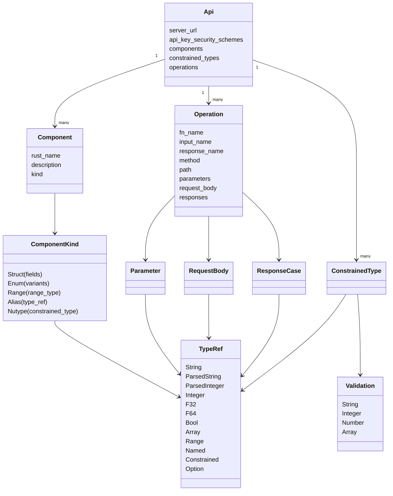
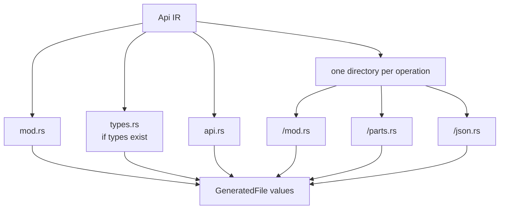

# Satay Codegen Architecture

This document describes the current architecture of `crates/satay-codegen`, the crate that turns an OpenAPI document into generated Rust source files.

`satay-codegen` is intentionally IO-free. Its public API accepts a spec string and returns in-memory `GeneratedFile` values. The CLI and examples decide where those files are written and whether they are formatted by external tools.

## Top-Level Pipeline

The public entry point is `satay_codegen::generate` in `crates/satay-codegen/src/lib.rs`.

Main boundaries:

- `parse` owns OpenAPI parsing, reference checking, supported-subset validation, and lowering into the internal IR.
- `ident` centralizes Rust identifier generation and de-duplication.
- `model` defines the internal IR consumed by rendering.
- `render` converts the IR to `syn` syntax trees, pretty-prints them with `prettyplease`, and returns generated file contents.
- `error` defines the public parse and validation errors returned by `generate`.

## Module Map

## Parse Stage

`parse::parse_document` parses the incoming string with `oas3::from_yaml` and stores the parsed `oas3::spec::Spec` in a small `Document` wrapper.

`parse::parse_api` runs three phases:

- `resolve::resolve_document` checks that supported local references point at existing component entries and that component-object reference chains are not circular.
- `validate::validate_document` checks the supported OpenAPI subset and produces validated component and operation values.
- `lower::lower_document` converts those validated values into the `model::Api` IR.

Reference resolution is deliberately split between validation and use:

- `resolve` validates references early but does not rewrite the OpenAPI tree.
- `reference.rs` contains on-demand helpers such as `resolve_parameter`, `resolve_request_body`, `resolve_response`, and `resolve_path_item` for validation and lowering.
- Schema `$ref`s are represented as named validated types and then named IR references to generated component types rather than expanded inline.

Only local component references are supported today, for example `#/components/schemas/User`. The supported component reference sections are `schemas`, `securitySchemes`, `parameters`, `requestBodies`, `responses`, and `pathItems`.

## Validation Stage

Validation is centered on `parse/validate/mod.rs` and produces a `ValidatedDocument`:

There is no separate normalization or schema-identity pass in the current implementation. Validation walks the resolved `oas3` document directly and builds validated data structures that lowering can consume without revisiting unsupported OpenAPI shapes.

`ValidatedDocument` stores:

- `resolved`: the borrowed `ResolvedDocument` used for data that still comes from the original spec, such as servers and security schemes.
- `components`: validated schema components as `ValidatedComponent` values.
- `operations`: validated path operations as `ValidatedOperation` values.

Schema decisions are carried by `ValidatedType`:

- `kind`: the validated shape, such as a named component, primitive, parsed string/integer, array, enum, or range.
- `nullable`: whether the OpenAPI schema allows `null`.
- `validation`: normalized string, integer, number, or array constraints that will render as `nutype` newtypes.
- `description`: the OpenAPI description, filtered to `None` when blank.
- `treat_error_as_none`: validated `x-satay.treat-error-as-none` metadata for struct fields.

Validation responsibilities are split by file:

- `validate/schema.rs` validates component schemas and inline type schemas, rejects unsupported schema shapes, validates enum shape, validates references, and records constraints on `ValidatedType`.
- `validate/operation.rs` validates paths, operation parameters, request bodies, responses, status codes, path placeholders, and JSON media-type requirements.
- `validate/constraint.rs` parses and normalizes string, integer, number, and array constraints for `nutype` rendering. It also infers integer types from bounds when no explicit `x-satay.integer-type` is provided.
- `validate/satay.rs` validates Satay vendor extensions such as `parse-as`, `integer-type`, `enum-variants`, and `treat-error-as-none`.
- `parse/satay.rs` contains lower-level `x-satay` parsing helpers shared by validation.

Unsupported OpenAPI features are rejected with `ValidationError` instead of being ignored. Lowering and rendering rely on those validation guarantees and use `unreachable!` or `expect` for states that validation should have made impossible.

## Lowering Stage

Lowering converts `ValidatedDocument` values into the codegen IR in `model.rs`.

`TypeRegistry` is the shared name allocator for generated helper types:

- Component names are reserved first to prevent collisions.
- Inline constrained schemas become generated `ConstrainedType`s and are referenced through `TypeRef::Constrained`.
- Inline string enums become extra `ComponentKind::Enum` components and are referenced through `TypeRef::Named`.
- Inline range schemas from `x-satay.parse-as` become extra `ComponentKind::Range` components and are referenced through `TypeRef::Range`.

`lower/schema.rs` converts component schemas and nested type schemas into:

- `ComponentKind::Struct` for object schemas with properties, including supported component `allOf` object branches flattened during validation.
- `ComponentKind::Enum` for non-null string enum components.
- `ComponentKind::Range` for non-null component-level string range schemas from `x-satay.parse-as`.
- `ComponentKind::Alias` for reference aliases, primitive aliases, arrays, nullable types, parsed string/integer values, ranges, and named aliases without top-level component constraints.
- `ComponentKind::Nutype` for non-null component schemas with validation constraints.

`lower/operation.rs` converts supported path operations into `Operation` values:

- Operation names come from `operationId`, or from an inferred `method + path` name.
- Validated operations already contain merged path-level and operation-level parameters; lowering assigns Rust field names and de-duplicates input fields.
- Path strings have already been split into literal and parameter `PathSegment`s during validation.
- Request bodies preserve the validated JSON media type and become a generated `body` input field, de-duplicated if a parameter already uses that name.
- Response cases preserve validated status-code ordering and response body types when a JSON schema exists.
- Header and query API-key security schemes are converted to `ApiKeySecurityScheme` values for the generated `Api` builder.

## Internal IR

The render layer consumes only `model::Api`, not raw `oas3` data.

Important IR conventions:

- `TypeRef::Named` points at a type in the generated `types.rs` file.
- `TypeRef::Constrained` points at an inline generated constrained type and keeps the inner type for request parameter serialization.
- `TypeRef::Option` maps to `Option<T>` during rendering.
- Optional fields are represented by `Field.required == false`; rendering decides whether to wrap in `Option<T>`.
- `Field.treat_error_as_none` forces `Option<T>` plus custom serde handling even when a property is required in OpenAPI.

## Rendering Stage

Rendering is orchestrated by `render::render_api` in `render/mod.rs`.

The renderer builds `syn::File` values with `quote` and `parse_quote`, then formats them with `prettyplease`. `format_file` also inserts a generated-file preamble and normalizes blank lines between items, impl methods, and members.

Shared rendering helpers in `render/mod.rs` handle:

- Identifier and string literal construction.
- Rustdoc attribute generation from OpenAPI descriptions.
- `TypeRef` to Rust type conversion.
- Operation input field construction.
- Optional-field wrapping and input builder argument conversion.
- Request body conversion mode selection.

Renderer submodules:

- `render/types` emits `types.rs` with structs, string enums, ranges, aliases, and `nutype` constrained types.
- `render/endpoint/input.rs` emits operation input structs, required-field constructors, optional-field setters, and `Default` when possible.
- `render/endpoint/response.rs` emits response enums with known status variants plus `UnexpectedStatus(http::StatusCode, Vec<u8>)`.
- `render/endpoint/parts.rs` emits `<operation>_parts`, which builds `satay_runtime::RequestParts<B>` without serializing JSON or choosing a transport.
- `render/endpoint/json.rs` emits `encode_<operation>` and `decode_<operation>_response` helpers behind the generated crate's `json` feature.
- `render/api.rs` emits the generated `Api` builder, API-key application, per-operation action structs, and `satay_runtime::Action` impls.

## Generated File Layout

| File | Purpose |
| --- | --- |
| `mod.rs` | Exposes `SERVER_URL`, optionally exposes `types`, re-exports endpoint modules, and gates the generated `api` module behind `feature = "json"`. |
| `types.rs` | Contains component structs, enums, range types, type aliases, and constrained `nutype` wrappers. Omitted when there are no components or constrained inline types. |
| `api.rs` | Contains the generated `Api` action builder, API-key setters, per-operation action structs, and `satay_runtime::Action` implementations. |
| `<operation>/mod.rs` | Re-exports `parts` and, behind `feature = "json"`, `json`. |
| `<operation>/parts.rs` | Contains `<Operation>Input`, `<Operation>Response`, and `<operation>_parts`. |
| `<operation>/json.rs` | Contains `encode_<operation>` and `decode_<operation>_response`. |

Generated code preserves Satay's sans-IO boundary:

- `<operation>_parts` returns `satay_runtime::RequestParts<B>`.
- `encode_<operation>` and action `request()` convert request parts into `http::Request<Vec<u8>>`.
- The generated `Action` impl lets adapters such as `satay-reqwest` and `satay-ureq` send requests without being coupled to codegen.

## Feature Gates In Generated Code

Generated code uses feature gates in the consumer crate:

- `json` gates the generated `api` module and endpoint JSON helpers.
- `serde` gates derives and serde field attributes for generated data types.

Validation newtypes render through `nutype`. Specs with validation constraints require the consuming crate to include `nutype`, and specs with `pattern` constraints also require `regex` support through `nutype`.

## Error Model And Invariants

The public error type is `satay_codegen::Error`:

- `ParseError` covers OpenAPI YAML parsing failures.
- `ValidationError` covers unsupported OpenAPI features, invalid schema shapes, invalid refs, invalid constraints, invalid `x-satay` metadata, and invalid operation definitions.

Rendering is not fallible in the public API. If rendering or lowering hits an impossible state, that is treated as an internal bug because validation should have rejected the input earlier.

Key invariants enforced before rendering:

- Only OpenAPI `3.1.x` documents are accepted.
- Only supported local references into `#/components/...` are accepted, and supported component-object reference chains are checked for cycles.
- Unsupported schema composition beyond local-ref `anyOf` unions and component object `allOf` flattening, map objects, inline object schemas outside supported `allOf` branches, boolean JSON Schemas, non-string enums, multi-type schemas beyond one non-null type plus `null`, content parameters, non-JSON bodies, default response bodies, nullable parameters, cookie parameters, array path/header parameters, and unsupported constraint keywords are rejected.
- Every operation has a `responses` object.
- Path parameters declared in the path template and parameter lists match.
- Request and response bodies used by generated JSON helpers have supported JSON media types.

## Extending Codegen

Most feature additions need changes in this order:

- Add or adjust `ValidationError` variants for the new supported or rejected cases.
- Update `parse/resolve` and `parse/reference` if the feature introduces new reference locations or resolution behavior.
- Update `parse/validate` so the new shape is either accepted into `Validated*` values or rejected explicitly.
- Extend `model.rs` only if the existing `TypeRef`, `ComponentKind`, or operation IR cannot represent the feature.
- Update `parse/lower` to produce the IR from validated data.
- Update `render` modules to emit Rust for the new IR.
- Add tests in `crates/satay-codegen/tests/generate.rs` or parser-focused tests under `parse/tests.rs`.

This ordering keeps the current contract intact: unsupported OpenAPI input fails during validation, and rendering can remain a straightforward IR-to-Rust transformation.
