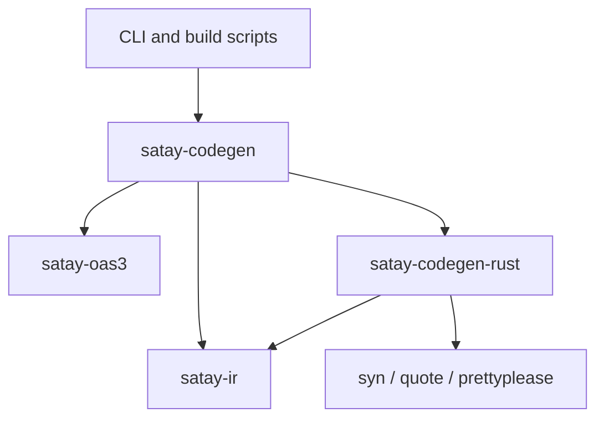
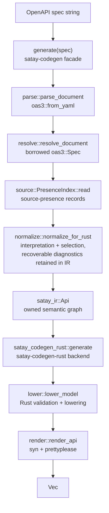
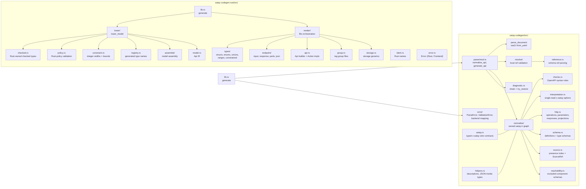
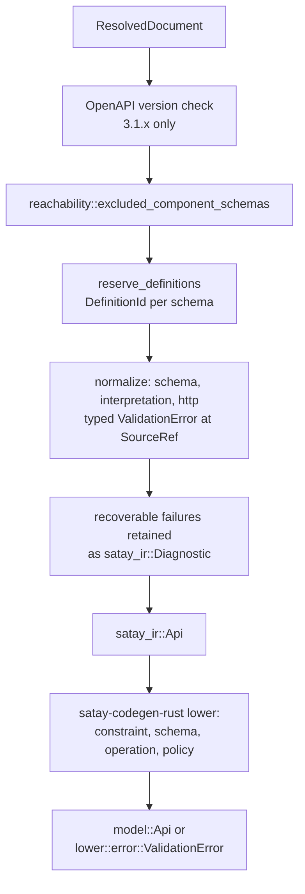
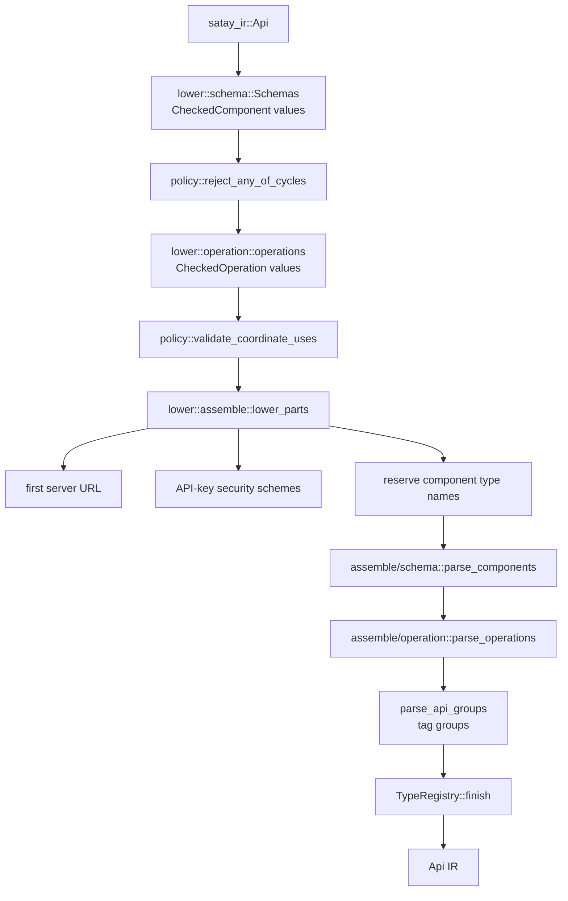
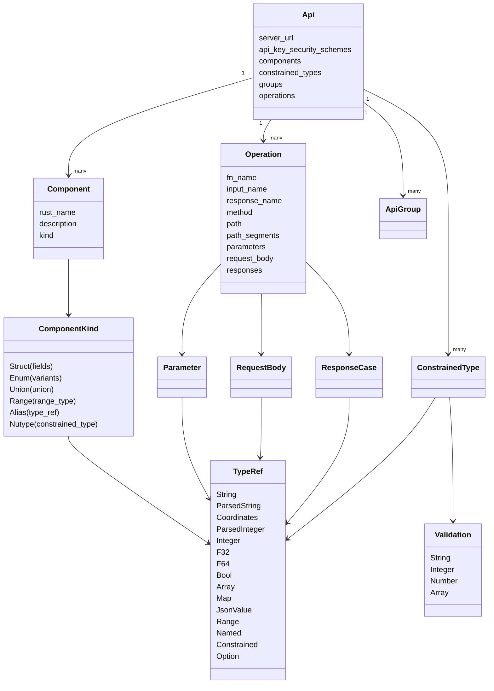
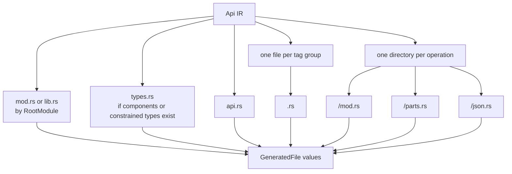

# Satay Codegen Architecture

This document describes the current architecture of the Satay code-generation crates, which turn an OpenAPI document into generated Rust source files.

Code generation is split across two crates:

- `crates/satay-codegen` is the OpenAPI-facing facade. It parses a spec string, normalizes it into the owned `satay-ir` semantic graph, and hands that graph to the Rust backend. It also owns the public error surface and translates backend errors into it.
- `crates/satay-codegen-rust` is the parser-independent Rust backend. It validates, lowers, and renders a finalized `satay_ir::Api` without ever seeing an OpenAPI document, and it works on hand-built graphs too.

Both crates are intentionally IO-free. The public API accepts a spec string and returns in-memory `GeneratedFile` values. The CLI and examples decide where those files are written and whether they are formatted by external tools.

## Crate Dependency Structure

Arrows below mean "depends on."


```mermaid
flowchart TD
    Consumers["CLI and build scripts"] --> facade["satay-codegen"]
    facade --> oas3["satay-oas3"]
    facade --> ir["satay-ir"]
    facade --> backend["satay-codegen-rust"]
    backend --> ir
    backend --> rendering["syn / quote / prettyplease"]
```

The backend has no dependency on the facade or the OpenAPI parser; `satay-ir` is independent of both crates. The facade brings in Rust rendering transitively through `satay-codegen-rust`.

## Top-Level Pipeline

The public entry point is `satay_codegen::generate` in `crates/satay-codegen/src/lib.rs`.


```mermaid
flowchart TD
    spec["OpenAPI spec string"] --> generate["generate(spec)<br/>satay-codegen facade"]
    generate --> parseDocument["parse::parse_document<br/>oas3::from_yaml"]
    parseDocument --> resolve["resolve::resolve_document<br/>borrowed oas3::Spec"]
    resolve --> presence["source::PresenceIndex::read<br/>source-presence records"]
    presence --> normalize["normalize::normalize_for_rust<br/>interpretation + selection,<br/>recoverable diagnostics retained in IR"]
    normalize --> api["satay_ir::Api<br/>owned semantic graph"]
    api --> backend["satay_codegen_rust::generate<br/>satay-codegen-rust backend"]
    backend --> lower["lower::lower_model<br/>Rust validation + lowering"]
    lower --> render["render::render_api<br/>syn + prettyplease"]
    render --> files["Vec<GeneratedFile>"]
```

Main boundaries:

- `parse` owns OpenAPI document parsing into the `oas3::spec::Spec` tree.
- `resolve` validates supported local references and component-object reference chains early, without rewriting the document.
- `normalize` converts the resolved document into the owned `satay_ir::Api` semantic graph, interpreting `x-satay` extensions along the way.
- `satay-ir` defines the parser- and target-independent semantic graph; it knows nothing about OpenAPI text or Rust.
- `satay-codegen-rust` consumes a finalized `satay_ir::Api` and performs Rust validation (`lower/error.rs`), lowering (`lower`), and rendering (`render`). It has no `oas3` or facade dependency.
- `error` in the facade defines the public `ParseError` and `ValidationError`, the exhaustive backend-error conversion in `error/backend.rs`, and the deferred-diagnostic compatibility translation in `parse/diagnostic.rs` (`try_restore`).

## Module Map


```mermaid
flowchart LR
    lib["lib.rs<br/>generate"] --> parseMod
    lib --> facadeError

    subgraph facade["satay-codegen/src/"]
        parseMod["parse/mod.rs<br/>normalize_api, generate_api"] --> parseDoc["parse_document<br/>oas3::from_yaml"]
        parseMod --> resolve
        parseMod --> normalize
        parseMod --> diagnostic
        resolve["resolve/<br/>local ref validation"] --> reference["reference.rs<br/>schema ref parsing"]
        normalize["normalize/<br/>owned satay-ir graph"] --> checks["checks.rs<br/>OpenAPI syntax rules"]
        normalize --> interpretation["interpretation.rs<br/>single-read x-satay options"]
        normalize --> http["http.rs<br/>operations, parameters,<br/>responses, projections"]
        normalize --> schema["schema.rs<br/>definitions + type schemas"]
        normalize --> source["source.rs<br/>presence index + SourceRef"]
        normalize --> reachability["reachability.rs<br/>excluded component schemas"]
        diagnostic["diagnostic.rs<br/>retain + try_restore"]
        satay["satay.rs<br/>typed x-satay wire contracts"]
        helpers["helpers.rs<br/>descriptions, JSON media types"]
        facadeError["error/<br/>ParseError, ValidationError,<br/>backend mapping"]
    end

    subgraph backend["satay-codegen-rust/src/"]
        lib2["lib.rs<br/>generate"] --> lowerMod
        lib2 --> renderMod
        lowerMod["lower/<br/>lower_model"] --> checked["checked.rs<br/>Rust-owned checked types"]
        lowerMod --> policy["policy.rs<br/>Rust-policy validation"]
        lowerMod --> constraint["constraint.rs<br/>integer widths + bounds"]
        lowerMod --> registry["registry.rs<br/>generated type names"]
        lowerMod --> assemble["assemble/<br/>model assembly"]
        lowerMod --> model["model.rs<br/>Api IR"]
        renderMod["render/<br/>file orchestration"] --> renderTypes["types/<br/>structs, enums, unions,<br/>ranges, constrained"]
        renderMod --> renderEndpoint["endpoint/<br/>input, response, parts, json"]
        renderMod --> renderApi["api.rs<br/>Api builder + Action impls"]
        renderMod --> group["group.rs<br/>tag group files"]
        renderMod --> storage["storage.rs<br/>storage generics"]
        ident["ident.rs<br/>Rust names"]
        backendError["error.rs<br/>Error::{Rust, Frontend}"]
    end

    satay --- normalize
    helpers --- normalize
```

The two subgraphs communicate only through the `satay_ir::Api` value and the backend's public `generate`, `GenerateOptions`, `GeneratedFile`, and `Error` types.

## Parse Stage

`parse::parse_document` parses the incoming string with `oas3::from_yaml` and stores the parsed `oas3::spec::Spec` in a small `Document` wrapper. The `oas3` Rust library is provided by the in-tree `satay-oas3` package, a source fork that preserves Schema Object `$ref` siblings and uses `serde-saphyr` for YAML.

`normalize::normalize_for_rust` runs the production frontend pipeline in four steps:

- `resolve::resolve_document` wraps the borrowed spec in a `ResolvedDocument` and checks that supported local references point at existing component entries and that component-object reference chains are not circular.
- `source::PresenceIndex::read` records which server, security, and default declarations were explicitly present in the source, so absent-versus-empty distinctions erased by the typed parser can be recovered later.
- `normalize_document` checks the supported OpenAPI version, selects reachable component schemas with `reachability.rs`, and reserves one `DefinitionId` per non-excluded schema, keyed by the decoded original component name.
- The conversion context drives `schema.rs` (definitions and type schemas), `interpretation.rs` (single-read `x-satay` option normalization), and `http.rs` (servers, security schemes, operations, parameters, request bodies, responses, and projections) into a `satay_ir::ApiBuilder`, whose finished graph is the only value that escapes.

Reference resolution is deliberately split between validation and use:

- `resolve` validates references early but does not rewrite the OpenAPI tree.
- `reference.rs` contains on-demand schema helpers such as `schema_component_ref` and `schema_type_and_nullable` for normalization.
- Schema `$ref`s become named IR references (`satay_ir::TypeExpr::Ref`) to their component definitions rather than expanded inline.

Only local component references are supported today, for example `#/components/schemas/User`. The supported component reference sections are `schemas`, `securitySchemes`, `parameters`, `requestBodies`, `responses`, and `pathItems`.

## Validation Stage

Validation is split between semantic normalization in `satay-codegen` and Rust-policy validation in `satay-codegen-rust`:


```mermaid
flowchart TD
    resolved["ResolvedDocument"] --> version["OpenAPI version check<br/>3.1.x only"]
    version --> reachability["reachability::excluded_component_schemas"]
    reachability --> reserve["reserve_definitions<br/>DefinitionId per schema"]
    reserve --> frontend["normalize: schema, interpretation, http<br/>typed ValidationError at SourceRef"]
    frontend --> retained["recoverable failures retained<br/>as satay_ir::Diagnostic"]
    retained --> api["satay_ir::Api"]
    api --> backend["satay-codegen-rust lower:<br/>constraint, schema, operation, policy"]
    backend --> model["model::Api or<br/>lower::error::ValidationError"]
```

The frontend owns OpenAPI syntax and selection. `normalize_document` rejects unsupported OpenAPI versions; `checks.rs` rejects unsupported sibling keywords around `$ref`, `allOf`, `anyOf`, `oneOf`, and discriminator unions; and `interpretation.rs` reads every `x-satay` extension exactly once through the typed wire contracts in `parse/satay.rs`, rejecting unknown or misplaced keys before anything enters the graph. Failures carry their `SourceRef` position and the legacy `ValidationError` payloads.

The backend owns Rust representability. It consumes only the semantic graph and generation options: no OpenAPI document, source-text lookup, or frontend query is available. During `lower::lower_model`, `constraint.rs` parses string, integer, number, and array constraints for `nutype` rendering and infers integer types from bounds when no explicit `x-satay.integer-type` is provided; `policy.rs` validates union shadows, identifier collisions, coordinate target uses, and parameter defaults; and `schema.rs`/`operation.rs` make the Rust type choices, choosing integer widths, applying codec and Serde policy, and preserving encounter order.

The production frontend entry `normalize_for_rust` retains recoverable failures at their schema or HTTP position, plus original numeric declarations when canonicalization would fail, instead of reporting them immediately. The Rust traversal can therefore report an earlier Rust-policy failure before a later frontend failure, with the legacy message and context preserved through diagnostic restoration. The strict `normalize_spec` entry reports normalization failures immediately and is test-gated. Graph finalization checks reference integrity even for recovering graphs; retention does not imply that every schema is valid for generation. Deferred diagnostics are target-neutral owned code/message records, not borrowed OpenAPI state.

Parity gates compare generated paths and bytes under both root-module options across the accepted fixture corpus and concrete generation-test specifications. Dedicated regressions cover cross-stage first-error selection, nested `allOf` aliases and ignored wire-name duplicates, and lowering a hand-built graph without source input.

Backend validation responsibilities are split by file:

- `lower/constraint.rs` adapts IR-declared constraints to Rust representations: string, integer, number, and array constraints for `nutype` rendering, integer-type inference from bounds, and overflow rejection for exclusive integer bounds.
- `lower/schema.rs` walks the graph and produces `CheckedComponent` values, rejecting unsupported Rust shapes (inline object schemas, map objects, unsupported compositions, duplicate union branches, and recursive compositions) with structured `lower/error.rs` payloads.
- `lower/policy.rs` is pure validation over checked values: union branch shadowing, `x-satay.enum-variants` name rules, identifier collision checks, coordinate target proofs, and parameter default constraints.
- `lower/operation.rs` checks parameter locations and defaults, request bodies, responses, status codes, path placeholders, and JSON media-type requirements.

Frontend validation responsibilities are split by file:

- `normalize/checks.rs` rejects unsupported sibling keywords around `$ref`, `allOf`, plain and discriminator-tagged unions, and annotation-only composition wrappers.
- `normalize/interpretation.rs` applies schema-interpretation rules such as `parse-as`, `none-if`, `integer-type`, `enum-variants`, `treat-error-as-none`, `ignore`, and `identifier`, including coordinate interpretation for object fields. Value and property contexts reject property-only keys on values, and the same context split controls which `x-satay` keys are legal beside `$ref`.
- `normalize/http.rs` validates paths, parameters, request bodies, responses, status codes, projections, and JSON media-type requirements while building the IR's HTTP graph.
- `parse/satay.rs` is the authoritative home for typed schema and operation `x-satay` wire contracts and their `schema_options` and `operation_options` accessors. The wire types use owned strings so normalization does not need to carry extension-value lifetimes.

The wire layer uses `#[serde(deny_unknown_fields)]` and validated newtypes for values with local invariants. It is intentionally separate from the vendor-neutral `satay-oas3::SpecificationExtensions::extension_as<T>()` API: `satay-oas3` provides typed extension deserialization and nested error paths, while `satay-codegen` owns Satay-specific contracts and policy. Only the frontend reads extension JSON; the backend consumes only the interpreted IR, and neither stage traverses raw extension JSON after interpretation.

A future parameter-group extension, for example:

```yaml
x-satay:
  parameter-groups:
    - at-most-one-of: [Date, $skip]
```

would extend only the centralized operation wire contract:

```rust
pub(crate) struct SatayOperationOptions {
    // Existing fields.
    pub(crate) parameter_groups: Vec<SatayParameterGroup>,
}

pub(crate) struct SatayParameterGroup {
    pub(crate) at_most_one_of: Vec<SatayParameterName>,
}
```

`normalize/http.rs` would resolve those wire names to validated parameter indices and record them in the IR. Backend lowering and rendering would consume only those resolved values and would not parse extension JSON directly. This documents the intended extension path; parameter-group behavior is not implemented yet.

Operation response projection follows the same boundary. `normalize/http.rs` resolves `x-satay.output` selectors and records `unwrap_required` and `map_required` in the IR's response projection; backend lowering carries the projection and the projected payload type into `ResponseCase`. Generated JSON decoders call `satay_runtime::from_projected_json_slice` to select the wire payload before normal serde deserialization. Rendering never revisits the OpenAPI extension value.

Unsupported OpenAPI features are rejected with `ValidationError` instead of being ignored. Backend lowering and rendering rely on those validation guarantees and use `unreachable!` or `expect` for states that validation should have made impossible.

## Lowering Stage

Lowering converts the owned `satay_ir::Api` into the codegen IR in `satay-codegen-rust`'s `model.rs`. `lower::lower_model` validates while it lowers and returns structured `lower::error::ValidationError` payloads for constructs the generated Rust types cannot represent.


```mermaid
flowchart TD
    api["satay_ir::Api"] --> schemas["lower::schema::Schemas<br/>CheckedComponent values"]
    schemas --> cycles["policy::reject_any_of_cycles"]
    cycles --> operations["lower::operation::operations<br/>CheckedOperation values"]
    operations --> coordinates["policy::validate_coordinate_uses"]
    coordinates --> assemble["lower::assemble::lower_parts"]
    assemble --> server["first server URL"]
    assemble --> security["API-key security schemes"]
    assemble --> reserve["reserve component type names"]
    reserve --> components["assemble/schema::parse_components"]
    components --> operationsModel["assemble/operation::parse_operations"]
    operationsModel --> groupsModel["parse_api_groups<br/>tag groups"]
    groupsModel --> finish["TypeRegistry::finish"]
    finish --> apiModel["Api IR"]
```

The lowering first walks the graph into Rust-owned checked values (`lower/checked.rs`), validates Rust-policy rules (`policy.rs`), and only then assembles the render model (`assemble/`).

`TypeRegistry` is the shared name allocator for generated helper types:

- Component names are reserved first to prevent collisions.
- Inline constrained schemas become generated `ConstrainedType`s and are referenced through `TypeRef::Constrained`.
- Inline supported `allOf` object schemas become extra `ComponentKind::Struct` components and are referenced through `TypeRef::Named`.
- Inline string enums become extra `ComponentKind::Enum` components and are referenced through `TypeRef::Named`.
- Inline range schemas from `x-satay.parse-as` become extra `ComponentKind::Range` components and are referenced through `TypeRef::Range`.

`lower/assemble/schema.rs` converts component schemas and nested type schemas into:

- `ComponentKind::Struct` for object schemas with properties, including supported component and generated inline `allOf` object branches flattened during normalization.
- `ComponentKind::Enum` for non-null string enum components.
- `ComponentKind::Union` for local-ref `anyOf` enums and supported discriminator-tagged `anyOf`/`oneOf` unions.
- `ComponentKind::Range` for non-null component-level string range schemas from `x-satay.parse-as`.
- `ComponentKind::Alias` for reference aliases, primitive aliases, arrays, nullable types, parsed string/integer values, ranges, and named aliases without top-level component constraints.
- `ComponentKind::Nutype` for non-null component schemas with validation constraints.

Struct properties retain both `Field.wire_name` and optional canonical `Field.identifier_words` in the IR. Lowering allocates a collision-free Rust name, while the Rust renderer applies snake_case and keyword escaping to explicit identifier words. This keeps the extension spelling target-neutral and makes the original wire key available for Serde metadata.

`lower/operation.rs` converts supported path operations into `Operation` values:

- Operation names come from `operationId`, or from an inferred `method + path` name.
- The IR keeps path-level and operation-local parameter lists separate in declaration order; lowering merges them per operation, assigning Rust field names and upserting duplicates by parameter location and wire name.
- Path strings are split into literal and parameter `PathSegment`s during lowering, which also rejects unclosed path parameters.
- Request bodies preserve the JSON media type and become a generated `body` input field, de-duplicated against parameter Rust names through the identifier registry.
- Response cases preserve IR status-code ordering and response body types when a JSON schema exists.
- Header and query API-key security schemes are converted to `ApiKeySecurityScheme` values for the generated `Api` builder.

## Internal IR

The render layer consumes only the backend's `model::Api`, not raw `oas3` data and not `satay-ir` types directly.


```mermaid
classDiagram
    class Api {
        server_url
        api_key_security_schemes
        components
        constrained_types
        groups
        operations
    }
    class Component {
        rust_name
        description
        kind
    }
    class ComponentKind {
        Struct(fields)
        Enum(variants)
        Union(union)
        Range(range_type)
        Alias(type_ref)
        Nutype(constrained_type)
    }
    class Operation {
        fn_name
        input_name
        response_name
        method
        path
        path_segments
        parameters
        request_body
        responses
    }
    class TypeRef {
        String
        ParsedString
        Coordinates
        ParsedInteger
        Integer
        F32
        F64
        Bool
        Array
        Map
        JsonValue
        Range
        Named
        Constrained
        Option
    }
    class Validation {
        String
        Integer
        Number
        Array
    }

    Api "1" --> "many" Component
    Api "1" --> "many" Operation
    Api "1" --> "many" ConstrainedType
    Api "1" --> "many" ApiGroup
    Component --> ComponentKind
    Operation --> Parameter
    Operation --> RequestBody
    Operation --> ResponseCase
    ComponentKind --> TypeRef
    Parameter --> TypeRef
    RequestBody --> TypeRef
    ResponseCase --> TypeRef
    ConstrainedType --> TypeRef
    ConstrainedType --> Validation
```

Important IR conventions:

- `TypeRef::Named` points at a type in the generated `types.rs` file.
- `TypeRef::Constrained` points at an inline generated constrained type and keeps the inner type for request parameter serialization.
- `TypeRef::Option` maps to `Option<T>` during rendering.
- `TypeRef::Map` maps to `BTreeMap<String, V>` and `TypeRef::JsonValue` to `satay_runtime::JsonValue` during rendering.
- Optional fields are represented by `Field.required == false`; rendering decides whether to wrap in `Option<T>`.
- Explicit property names are represented by `Field.identifier_words`; `Field.wire_name` always remains the OpenAPI property key used for wire metadata.
- `Field.treat_error_as_none` forces `Option<T>` plus custom serde handling even when a property is required in OpenAPI.
- `Field.none_if` forces `Option<T>` and generated field-specific serde helpers that preserve the configured string parser while recognizing exact sentinel strings.

Schemas marked with `x-satay.ignore` never enter the semantic graph. Duplicate wire names inside supported `allOf` branches are rejected during backend validation (`DuplicateAllOfProperty`) before the codegen `Field` IR is built. Lowering translates the IR's identifier words and decoding policies into the `Field` representation and never revisits `x-satay` extension data.

## Rendering Stage

Rendering is orchestrated by `render::render_api` in `satay-codegen-rust`'s `render/mod.rs`.


```mermaid
flowchart TD
    api["Api IR"] --> topMod["mod.rs or lib.rs<br/>by RootModule"]
    api --> typesFile["types.rs<br/>if components or constrained types exist"]
    api --> apiFile["api.rs"]
    api --> groupFiles["one file per tag group"]
    api --> endpointFiles["one directory per operation"]

    groupFiles --> groupRs["<group>.rs"]
    endpointFiles --> endpointMod["<operation>/mod.rs"]
    endpointFiles --> parts["<operation>/parts.rs"]
    endpointFiles --> json["<operation>/json.rs"]

    topMod --> generated["GeneratedFile values"]
    typesFile --> generated
    apiFile --> generated
    groupRs --> generated
    endpointMod --> generated
    parts --> generated
    json --> generated
```

The renderer builds `syn::File` values with `quote` and `parse_quote`, then formats them with `prettyplease`. `format_file` prepends the generated-file preamble to the pretty-printed output.

Before rendering, `render/storage.rs` applies storage generics to schema-derived types so generated models and actions can pick dynamic string storage. Shared rendering helpers in `render/mod.rs` handle:

- Identifier and string literal construction.
- Rustdoc attribute generation from descriptions.
- `TypeRef` to Rust type conversion, including optional-field wrapping.
- Operation input field construction and input builder argument conversion.
- Request parts expression selection.

Renderer submodules:

- `render/types` emits `types.rs` with structs, string enums, unions, ranges, aliases, and `nutype` constrained types.
- `render/endpoint/input.rs` emits operation input structs, required-field constructors, optional-field setters, and `Default` when possible.
- `render/endpoint/response.rs` emits response enums with known status variants plus `UnexpectedStatus(http::StatusCode, Vec<u8>)`.
- `render/endpoint/parts.rs` emits `<operation>_parts`, which builds `satay_runtime::RequestParts<B>` without serializing JSON or choosing a transport.
- `render/endpoint/json.rs` emits `encode_<operation>` and `decode_<operation>_response` helpers behind the generated crate's `json` feature.
- `render/api.rs` emits the generated `Api` builder, API-key application, per-operation action structs, and `satay_runtime::Action`/`OwnedAction` impls.
- `render/group.rs` emits one `<group>.rs` file per OpenAPI tag, with a group struct exposing that tag's operations.

## Generated File Layout

| File | Purpose |
| --- | --- |
| `mod.rs` (or `lib.rs` by `RootModule`) | Exposes `SERVER_URL`, optionally exposes `types`, re-exports group and endpoint modules, and gates the generated `api` module behind `feature = "json"`. |
| `types.rs` | Contains component structs, enums, unions, range types, type aliases, and constrained `nutype` wrappers. Omitted when there are no components or constrained inline types. |
| `api.rs` | Contains the generated `Api` action builder, API-key setters, per-operation action structs, and `satay_runtime::Action` implementations. |
| `<group>.rs` | Contains one group struct per OpenAPI tag, exposing that tag's operations behind `feature = "json"`. |
| `<operation>/mod.rs` | Re-exports `parts` and, behind `feature = "json"`, `json`. |
| `<operation>/parts.rs` | Contains `<Operation>Input`, `<Operation>Response`, and `<operation>_parts`. |
| `<operation>/json.rs` | Contains `encode_<operation>` and `decode_<operation>_response`. |

Generated code preserves Satay's sans-IO boundary:

- `<operation>_parts` returns `satay_runtime::RequestParts<B>`.
- `encode_<operation>` and action `request()` convert request parts into `http::Request<Vec<u8>>`.
- The generated `Action` impl lets adapters such as `satay-reqwest` and `satay-ureq` send requests without being coupled to codegen.

## Feature Gates In Generated Code

Generated code uses feature gates in the consumer crate:

- `json` gates the generated `api` module and endpoint JSON helpers.
- `serde` gates derives and serde field attributes for generated data types.

Validation newtypes render through `nutype`. Specs with validation constraints require the consuming crate to include `nutype`, and specs with `pattern` constraints also require `regex` support through `nutype`.

## Error Model And Invariants

The public error type is `satay_codegen::Error`:

- `ParseError` covers OpenAPI YAML parsing failures.
- `ValidationError` covers unsupported OpenAPI features, invalid schema shapes, invalid refs, invalid constraints, invalid `x-satay` metadata, Rust-representability rejections, and invalid operation definitions.
- `Internal` covers compiler-stage failures that no existing parse or validation diagnostic can represent, such as a retained semantic diagnostic without a legacy shape.

The backend reports failures through `satay_codegen_rust::Error`: `Rust(ValidationError)` for Rust-policy rejections with structured, parser-independent payloads, and `Frontend(Diagnostic)` for semantic diagnostics retained in the input graph. The facade translates these back into the public error type: `error/backend.rs` maps backend `ValidationError` values field-for-field through an exhaustive macro table, and `parse/diagnostic.rs::try_restore` rebuilds the legacy `ValidationError` from a retained diagnostic. Both mappings are exhaustive matches, so either side gains a variant only by updating the compatibility boundary. A diagnostic kind with no legacy shape becomes `Error::Internal`.

Rendering is not fallible in the public API. If rendering hits an impossible state, that is treated as an internal bug because validation should have rejected the input earlier.

Key invariants enforced before rendering:

- Only OpenAPI `3.1.x` documents are accepted.
- Only supported local references into `#/components/...` are accepted, and supported component-object reference chains are checked for cycles.
- Unsupported schema composition beyond local-ref `anyOf` unions, supported discriminator-tagged `anyOf`/`oneOf` unions, and object-branch `allOf` flattening in component or JSON type positions, map objects, inline object schemas outside supported `allOf` branches, boolean JSON Schemas, non-string enums, multi-type schemas beyond one non-null type plus `null`, content parameters, non-JSON bodies, default response bodies, nullable parameters, `allOf` parameters, cookie parameters, array path/header parameters, and unsupported constraint keywords are rejected.
- Every operation has a `responses` object.
- Path parameters declared in the path template and parameter lists match.
- Request and response bodies used by generated JSON helpers have supported JSON media types.

## Extending Codegen

Most feature additions need changes in this order:

- Add or adjust `ValidationError` variants in the crate that owns the rejection: `crates/satay-codegen` for OpenAPI syntax and selection, or `crates/satay-codegen-rust` for Rust representability. Keep the exhaustive mapping tables in `error/backend.rs` and `parse/diagnostic.rs` in sync with any variant changes.
- Update `parse/resolve` and `parse/reference` if the feature introduces new reference locations or resolution behavior.
- Extend `parse/satay.rs` if the feature introduces new `x-satay` wire keys, then teach `parse/normalize` to interpret them into the semantic IR.
- Extend `satay-ir` only if the existing graph types cannot represent the feature.
- Update `crates/satay-codegen-rust/src/lower` to validate and lower the feature into the model.
- Extend `model.rs` only if the existing `TypeRef`, `ComponentKind`, or operation IR cannot represent the feature.
- Update `render` modules to emit Rust for the new IR.
- Add tests in `crates/satay-codegen/tests/generate/` or parser-focused tests under `crates/satay-codegen/src/parse/tests/`.

This ordering keeps the current contract intact: unsupported OpenAPI input fails during normalization or backend validation, and rendering can remain a straightforward IR-to-Rust transformation.
